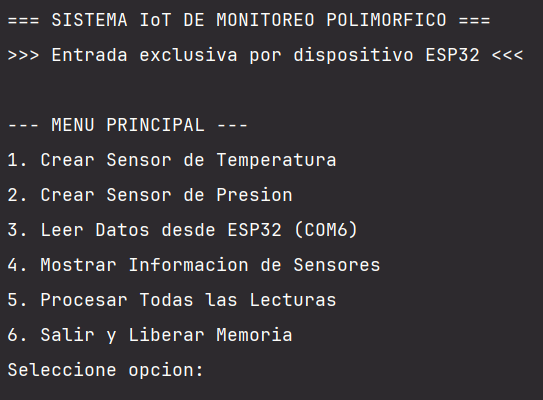
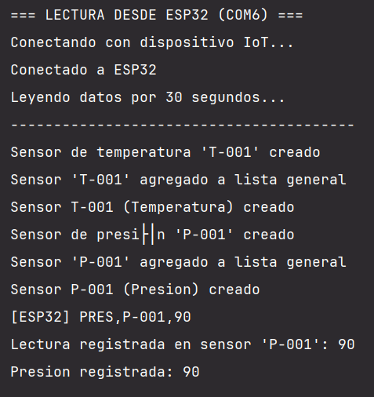
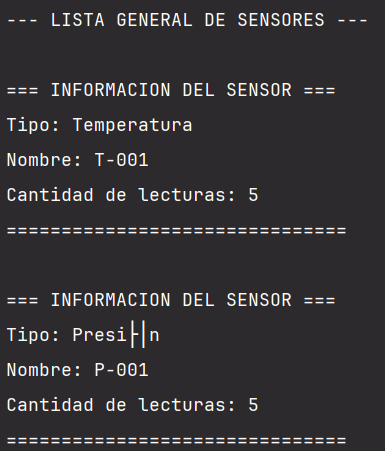
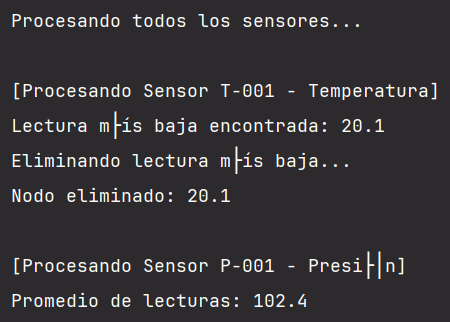
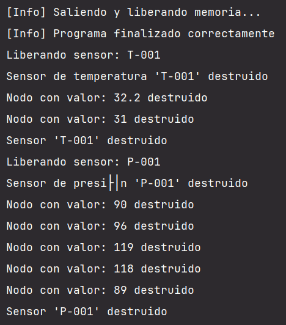

# Reporte: Sistema de Gestión Polimórfica de Sensores para IoT

**Autor:** Angel Gabriel Coronado Sánchez 
**Matrícula:** 2430124
**Materia:** Estructuras de datos 
**Fecha:** 30 de Octubre del 2025

---

## Tabla de Contenidos

1. [Introducción](#1-introducción)
2. [Manual Técnico](#2-manual-técnico)
   - 2.1 [Diseño](#21-diseño)
   - 2.2 [Desarrollo](#22-desarrollo)
   - 2.3 [Componentes](#23-componentes)
3. [Pantallazos de Implementación](#3-pantallazos-de-implementación)
4. [Conclusiones](#4-conclusiones)

---

## 1. Introducción

### Contexto del Problema

Una empresa de monitoreo de Infraestructura Crítica (IC) necesita un sistema de bajo nivel para registrar, almacenar y procesar lecturas de múltiples tipos de sensores (temperatura, presión) de manera unificada.

El sistema debe superar dos grandes limitaciones de diseño:

1. **Rigidez del Tipo de Dato:** Las lecturas pueden ser enteras (ej. presión) o de punto flotante (ej. temperatura), por lo que el contenedor debe ser genérico.

2. **Rigidez de la Estructura:** Se necesita una estructura de datos que se adapte al número variable de lecturas sin desperdiciar memoria.

### Objetivo del Proyecto

Crear una **Jerarquía de Clases Polimórfica** que gestione **Listas Enlazadas Simples Genéricas** (`ListaSensor<T>`). El diseño permite que cualquier tipo de sensor (subclase) pueda ser agregado a una única lista de gestión, forzando la implementación de métodos esenciales a través de Clases Abstractas.

### Alcance

El sistema incluye:
- Simulación de señales mediante dispositivo Arduino (ESP32) desde puerto serial
- Registro polimórfico de sensores en una única lista de gestión
- Inserción genérica de lecturas (`float` o `int`) en listas internas
- Procesamiento polimórfico con lógica específica por tipo de sensor
- Sistema redistribuible mediante CMake
- Documentación completa con Doxygen

---

## 2. Manual Técnico

### 2.1 Diseño

#### Clase Base Abstracta: `SensorBase`

**Propósito:** Define la interfaz común para todos los sensores.

**Características:**
- Métodos virtuales puros: `procesarLectura()` y `mostrarInfo()`
- Atributo protegido: `char nombre[50]` (identificador del sensor)
- Destructor virtual para polimorfismo correcto

```cpp
class SensorBase {
protected:
    char nombre[50];
public:
    SensorBase(const char* nombreSensor);
    virtual ~SensorBase();
    virtual void procesarLectura() = 0;
    virtual void mostrarInfo() const = 0;
    const char* obtenerNombre() const;
};
```

#### Clases Derivadas Concretas

**`SensorTemperatura`:** 
- Maneja lecturas tipo `float`
- Contiene `ListaSensor<float> historial`
- **Procesamiento:** Encuentra y elimina la lectura más baja

**`SensorPresion`:**
- Maneja lecturas tipo `int`
- Contiene `ListaSensor<int> historial`
- **Procesamiento:** Calcula el promedio de todas las lecturas

#### Lista Enlazada Genérica: `ListaSensor<T>`

**Propósito:** Almacenar lecturas de forma dinámica usando templates.

**Estructura de Nodo:**
```cpp
template <typename T>
struct Nodo {
    T dato;
    Nodo<T>* sig;
};
```

**Operaciones implementadas:**
- `insertar(T valor)`: Inserta al final de la lista
- `busqueda(T valor)`: Busca un valor en la lista
- `eliminarValor(T valor)`: Elimina la primera ocurrencia
- `obtenerTamanio()`: Retorna cantidad de elementos

**Regla de los Tres:**
- Destructor: Libera todos los nodos
- Constructor de copia: Crea copia profunda
- Operador de asignación: Libera y copia

#### Lista de Gestión Polimórfica: `ListaGeneral`

**Propósito:** Gestionar sensores heterogéneos mediante punteros a la clase base.

**Estructura de Nodo:**
```cpp
struct NodoGeneral {
    SensorBase* sensor;  // Puntero polimórfico
    NodoGeneral* siguiente;
};
```

**Operaciones principales:**
- `insertarSensor(SensorBase* sensor)`: Agrega cualquier tipo de sensor
- `procesarTodos()`: Ejecuta procesamiento polimórfico en todos los sensores
- `mostrarTodos()`: Muestra información de todos los sensores
- `buscarSensor(const char* nombre)`: Busca sensor por nombre

### 2.2 Desarrollo

#### Tecnologías Utilizadas

| Componente | Tecnología | Propósito |
|------------|-----------|-----------|
| Lenguaje | C++ (C++14) | Lenguaje principal |
| Compilador | MinGW/GCC | Compilación del código |
| Build System | CMake | Gestión de compilación multiplataforma |
| Documentación | Doxygen | Generación automática de documentación |
| Hardware | ESP32 | Adquisición de datos por serial |
| Comunicación | WinAPI Serial | Lectura del puerto COM6 a 9600 baud |

#### Decisiones de Diseño Clave

**1. Templates para Listas Genéricas**

**Decisión:** Usar `template <typename T>` para `ListaSensor`.

**Justificación:**
- Reutilización de código para diferentes tipos (`int`, `float`)
- Type-safe en tiempo de compilación
- Cumple requisito de no usar STL

**2. Polimorfismo mediante Clase Base Abstracta**

**Decisión:** `SensorBase` con métodos virtuales puros.

**Justificación:**
- Permite tratar sensores heterogéneos de manera uniforme
- Extensible: fácil agregar nuevos tipos de sensores
- Binding dinámico ejecuta lógica específica de cada tipo

**3. Gestión de Memoria Manual**

**Decisión:** Implementar Regla de los Tres manualmente.

**Justificación:**
- Requisito del proyecto: prohibido usar STL
- Evita fugas de memoria (memory leaks)
- Previene double-free en copias superficiales

**4. Comunicación Serial con ESP32**

**Decisión:** WinAPI para lectura del puerto COM.

**Justificación:**
- Control directo del hardware sin librerías externas
- Configuración precisa de parámetros (9600 baud, 8N1)
- Timeouts configurables para lectura no bloqueante

**Formato de datos:** CSV simple
```
TEMP,timestamp,valor
PRES,timestamp,valor
```

#### Arquitectura del Código

**Estructura de archivos:**
```
├── main.cpp                    # Programa principal
├── SensorBase.h                # Clase abstracta
├── SensorTemperatura.h         # Sensor concreto
├── SensorPresion.h             # Sensor concreto
├── ListaSensor.h               # Lista genérica (template)
├── ListaGeneral.h              # Lista polimórfica
├── CMakeLists.txt              # Configuración CMake
├── Doxyfile                    # Configuración Doxygen
└── docs/html/                  # Documentación generada
```

**Flujo de ejecución:**

1. Usuario selecciona "Leer Datos desde ESP32"
2. `main.cpp` abre puerto COM6 con WinAPI
3. Lee buffer de 256 bytes cada 100ms durante 30 segundos
4. Parser identifica tipo de sensor en formato CSV
5. Busca sensor correspondiente en `ListaGeneral`
6. Realiza `dynamic_cast` a tipo específico
7. Registra lectura en `ListaSensor<T>` interna
8. Usuario selecciona "Procesar Todas las Lecturas"
9. `ListaGeneral::procesarTodos()` itera sobre sensores
10. Llamada polimórfica ejecuta lógica específica:
    - `SensorTemperatura`: elimina lectura mínima
    - `SensorPresion`: calcula promedio

### 2.3 Componentes

#### SensorBase (Clase Abstracta)

**Responsabilidad:** Define interfaz común para todos los sensores.

**Métodos virtuales puros:**
- `procesarLectura()`: Cada tipo implementa su lógica
- `mostrarInfo()`: Cada tipo muestra su información

**Importancia del destructor virtual:**
Sin `virtual ~SensorBase()`, al hacer `delete sensor` sobre un `SensorBase*` que apunta a `SensorTemperatura`, solo se llamaría al destructor base, causando fugas de memoria en el `historial` interno.

#### SensorTemperatura

**Lógica de procesamiento:**
```cpp
void procesarLectura() override {
    // Buscar temperatura mínima
    float minima = 9999.9f;
    Nodo<float>* actual = historial.obtenerCabeza();
    while (actual != nullptr) {
        if (actual->dato < minima) {
            minima = actual->dato;
        }
        actual = actual->sig;
    }
    // Eliminar temperatura mínima
    historial.eliminarValor(minima);
}
```

**Justificación:** Eliminar lecturas anómalas bajas que podrían indicar fallos del sensor.

#### SensorPresion

**Lógica de procesamiento:**
```cpp
void procesarLectura() override {
    // Sumar todas las lecturas
    int suma = 0;
    Nodo<int>* actual = historial.obtenerCabeza();
    while (actual != nullptr) {
        suma += actual->dato;
        actual = actual->sig;
    }
    // Calcular promedio
    float promedio = static_cast<float>(suma) / historial.obtenerTamanio();
    std::cout << "Promedio: " << promedio << std::endl;
}
```

**Justificación:** El promedio proporciona medida estable de presión atmosférica.

#### ListaSensor<T> (Template)

**Implementación de Regla de los Tres:**

```cpp
// Destructor
~ListaSensor() {
    Nodo<T>* actual = cabeza;
    while (actual != nullptr) {
        Nodo<T>* sig = actual->sig;
        delete actual;
        actual = sig;
    }
}

// Constructor de copia
ListaSensor(const ListaSensor<T>& otra) : cabeza(nullptr) {
    Nodo<T>* actual = otra.cabeza;
    while (actual != nullptr) {
        insertar(actual->dato);
        actual = actual->sig;
    }
}

// Operador de asignación
ListaSensor<T>& operator=(const ListaSensor<T>& otra) {
    if (this != &otra) {
        // Liberar memoria actual
        // Copiar desde otra
    }
    return *this;
}
```

**Complejidad de operaciones:**
- Insertar al final: O(n)
- Buscar: O(n)
- Eliminar: O(n)
- Obtener tamaño: O(n)

#### ListaGeneral (Polimórfica)

**Destructor con liberación en cascada:**
```cpp
~ListaGeneral() {
    NodoGeneral* actual = cabeza;
    while (actual != nullptr) {
        NodoGeneral* siguiente = actual->siguiente;
        delete actual->sensor;  // Destrucción polimórfica
        delete actual;
        actual = siguiente;
    }
}
```

**Proceso de destrucción:**
1. `delete actual->sensor` llama al destructor virtual
2. Binding dinámico invoca destructor de clase derivada
3. Destructor derivado libera su `ListaSensor<T>` interna
4. Destructor de `ListaSensor<T>` libera todos sus nodos
5. Finalmente se llama al destructor base

#### main.cpp - Función `leerDatosESP32()`

**Proceso completo:**

1. **Apertura de puerto serial:**
```cpp
HANDLE hSerial = CreateFileA("\\\\.\\COM6", 
    GENERIC_READ, 0, NULL, OPEN_EXISTING, 
    FILE_ATTRIBUTE_NORMAL, NULL);
```

2. **Configuración de parámetros:**
```cpp
dcbSerialParams.BaudRate = 9600;
dcbSerialParams.ByteSize = 8;
dcbSerialParams.StopBits = ONESTOPBIT;
dcbSerialParams.Parity = NOPARITY;
```

3. **Creación de sensores por defecto:**
```cpp
if (lista.buscarSensor("T-001") == nullptr) {
    SensorTemperatura* tempSensor = new SensorTemperatura("T-001");
    lista.insertarSensor(tempSensor);
}
```

4. **Lectura durante 30 segundos:**
```cpp
while (chrono::steady_clock::now() - startTime < chrono::seconds(30)) {
    ReadFile(hSerial, buffer, sizeof(buffer) - 1, &bytesRead, NULL);
    // Procesar líneas completas
}
```

5. **Parsing de datos CSV:**
```cpp
if (linea.find("TEMP,") == 0) {
    size_t lastComma = linea.find_last_of(",");
    string valorStr = linea.substr(lastComma + 1);
    float temp = stof(valorStr);
    // Registrar en sensor
}
```

---

## 3. Pantallazos de Implementación

### 3.1 Ejecución del Menú Principal



---

### 3.2 Lectura desde ESP32



---

### 3.3 Mostrar Información de Sensores



---

### 3.4 Procesamiento Polimórfico



---

### 3.5 Liberación de Memoria al Salir



---

## 4. Conclusiones

### Objetivos Alcanzados

✅ **Jerarquía Polimórfica:** Se implementó exitosamente `SensorBase` como clase abstracta con `SensorTemperatura` y `SensorPresion` como clases derivadas, demostrando el uso de métodos virtuales puros y binding dinámico.

✅ **Listas Enlazadas Genéricas:** La implementación de `ListaSensor<T>` mediante templates permitió almacenar diferentes tipos de datos (`float` e `int`) sin duplicar código, cumpliendo el requisito de no usar STL.

✅ **Gestión de Memoria:** La Regla de los Tres fue implementada correctamente, garantizando que no existan fugas de memoria al liberar todos los recursos dinámicos.

✅ **Comunicación Serial:** Se logró establecer comunicación exitosa con ESP32 mediante WinAPI, leyendo y parseando datos en formato CSV durante 30 segundos.

✅ **Procesamiento Polimórfico:** El método `procesarTodos()` de `ListaGeneral` ejecuta correctamente la lógica específica de cada tipo de sensor mediante polimorfismo.

✅ **Documentación con Doxygen:** Se generó documentación técnica completa y profesional de todo el sistema.

✅ **Sistema Redistribuible:** El uso de CMake permite compilar el proyecto en diferentes plataformas de manera sencilla.

---

**Fin del Reporte**